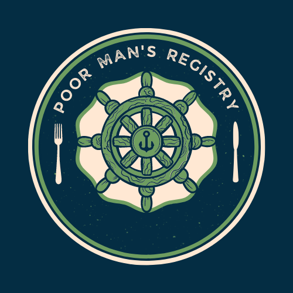
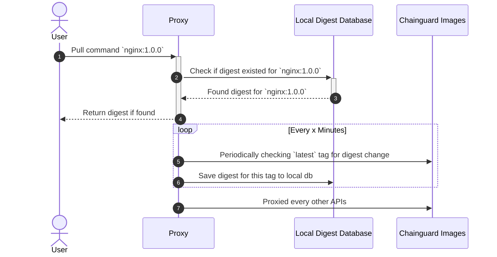

# Poor Man Registry

A poor man's registry that redirect to Chainguard's container registry. 

[](https://raw.githubusercontent.com/nduyphuong/reverse-registry/dev/LICENSE)
[](https://github.com/jacobnguyenn/reverse-registry/actions)


[](https://deploy.cloud.run/?git_repo=https://github.com/jacobnguyenn/poorman-registry.git)

## Motivation
- The public, free tier of Chainguard Images only serves `latest` tag. This could be of inconvenience so we build this to continously watching Chainguard registry for digest changes and extract the package version via SBOM. We then tag the image according with the packaged software version and serve via this proxy.

## Usage

```bash
go run main.go server --config=config.yaml
```

## How it works


