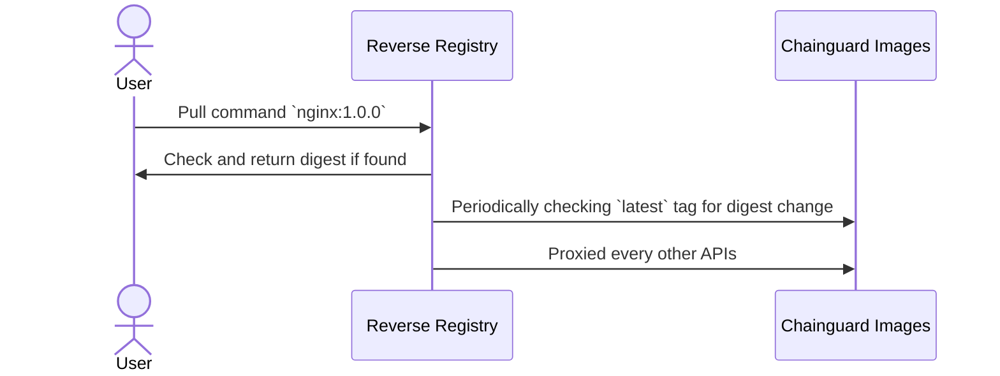

# Reverse registry

This is Chainguard reverse registry that redirect to Chainguard's `cgr.dev/chainguard/*` public registry. The public, free tier of Chainguard Images only serves `latest` tag. This could be of inconvenience so we wrote this reverse registry to continously watching Chainguard registry for digest changes and extract the package version via SBOM. We then tag the image according with the packaged software version and serve via this reverse registry.

By default, in-mem sqlite is used but MySQL is recommended for production setup.
## Usage

To be update

How to run this locally/production.
## How it works

Just an example. Need to update this accordingly.

## Deploy with Cloud Run

